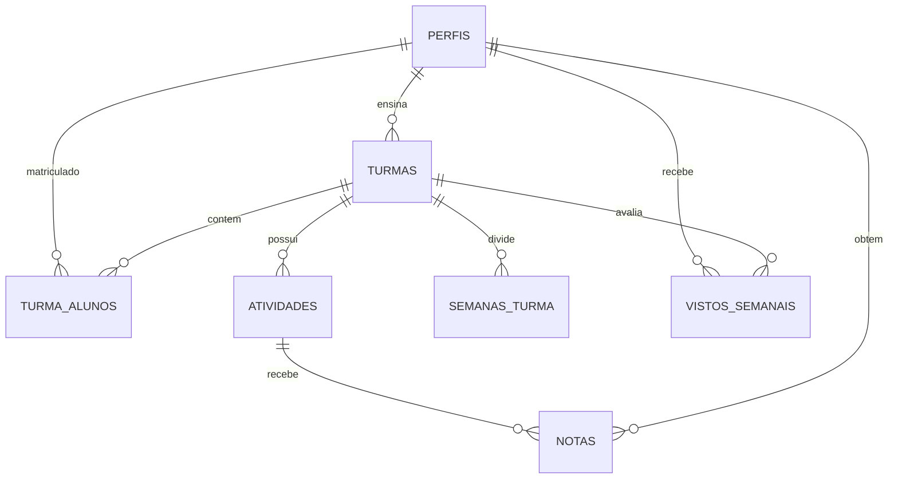

[](https://github.com/MaelBG/Media_facil/actions/workflows/ci.yml)

# 🎓 Média Fácil — Portal de Notas Acadêmico

> **Média Fácil** é uma plataforma escolar moderna, fluida e intuitiva desenvolvida para desonerar a carga cognitiva de professores e alunos. O sistema simplifica o acompanhamento de notas, o registro de vistos em cadernos e o cálculo automático de médias ponderadas complexas.

---

## 🚀 Principais Funcionalidades

### 👨‍🏫 Painel do Professor
* **Gestão de Turmas:** Criação e acompanhamento de múltiplas turmas de forma independente.
* **Fórmula de Média Personalizável:** Configure pesos específicos (em %) para:
  * Provas Tradicionais.
  * Prova Paulista (sistema padrão de avaliação do estado).
  * Atividades Práticas.
  * Vistos em Cadernos.
* **Boletim Interativo:** Grade de notas em tempo real com salvamento automático e validação de limites de pontuação.
* **Controle Semanal de Vistos:** Gestão de vistos de caderno organizada por semanas letivas dinâmicas.
* **Cadastro Integrado de Alunos:** Criação de contas de alunos direto pelo painel de forma simplificada, gerando credenciais automáticas de acesso.

### 👩‍🎓 Painel do Aluno
* **Painel de Rendimento:** Acompanhamento transparente do boletim individual em tempo real.
* **Cálculo da Média Ponderada:** Visualização detalhada do impacto de cada tipo de avaliação na média final.
* **Painel de Vistos:** Histórico visual de cadernos verificados e pendências de vistos por semana.
* **Interface Responsiva:** Design limpo e adaptado para visualização em celulares.

### 🔌 Arquitetura Híbrida Inteligente
* **Fallback Local Automático:** Se as chaves do Supabase não forem detectadas no ambiente, o sistema executa perfeitamente em modo de simulação utilizando `localStorage`.
* **Sincronização Cloud:** Com o `.env` configurado, o aplicativo conecta-se diretamente à infraestrutura Supabase.

---

## 🛠️ Tecnologias Utilizadas

* **Frontend:** [React 18](https://react.dev/) + [Vite](https://vite.dev/) (Rápido HMR e Build Otimizado)
* **Estilização:** [TailwindCSS](https://tailwindcss.com/) (Interface minimalista e responsiva baseado em tokens do Material 3)
* **Banco de Dados & Autenticação:** [Supabase](https://supabase.com/) (PostgreSQL, GoTrue Auth e RLS)
* **Ícones:** [Lucide React](https://lucide.dev/)

---

## 📁 Estrutura de Banco de Dados (Supabase)

O banco de dados é governado por regras de integridade e políticas de segurança granulares:



### Detalhes das Políticas de Segurança (RLS)
Para evitar o problema comum de **recursão infinita** nas políticas relacionais do Postgres, o sistema adota um esquema de segurança avançado:
* **Esquema Privado (`private`):** Encapsula funções de checagem com privilégios de `SECURITY DEFINER` (bypass RLS apenas para validação de posse):
  * `private.is_professor_of_turma(turma_id, user_id)`: Valida se o usuário é o docente da turma.
  * `private.is_aluno_in_turma(turma_id, user_id)`: Valida se o estudante está matriculado na turma.
* **RLS em Todas as Tabelas:** Nenhuma leitura ou escrita é exposta ao client-side sem verificação explícita do token JWT (`auth.uid()`).

---

## 💻 Configuração e Instalação Local

### 1. Requisitos Prévios
* [Node.js](https://nodejs.org/) (Versão 18 ou superior)
* Conta no [Supabase](https://supabase.com/) (opcional, para modo nuvem)

### 2. Clonar e Instalar Dependências
```bash
# Clone o repositório
git clone <url-do-repositorio>
cd Media_facil

# Instale as dependências
npm install
```

### 3. Variáveis de Ambiente
Crie um arquivo `.env` na raiz do projeto com suas credenciais do Supabase (use o modelo `.env.example` como base):
```env
VITE_SUPABASE_URL=https://seu-projeto.supabase.co
VITE_SUPABASE_ANON_KEY=sua-chave-anon-publica-aqui
```

### 4. Inicializar o Banco de Dados (Caso use Supabase)
Execute o script presente em `supabase/schema.sql` no **SQL Editor** do seu painel do Supabase para criar as tabelas, triggers de sincronização de auth e políticas de RLS.

### 5. Executar o Aplicativo
```bash
# Iniciar o servidor local de desenvolvimento
npm run dev
```
Acesse `http://localhost:5173/` no seu navegador.

---

## 🎨 Diretrizes de Design
O design foi construído sobre o conceito **Serene Academic Interface** detalhado no guia `DESIGN.md`. A paleta de cores foca em tons pastéis de alta acessibilidade para reduzir o cansaço visual após horas de uso letivo:
* **Primary (Serenity Blue):** `#3b608c` - Estabilidade e foco acadêmico.
* **Secondary (Mint Green):** `#366758` - Progresso positivo e conclusão.
* **Surface Background:** Tons frios neutros de `#f9f9fa` a `#e2e2e3`.
