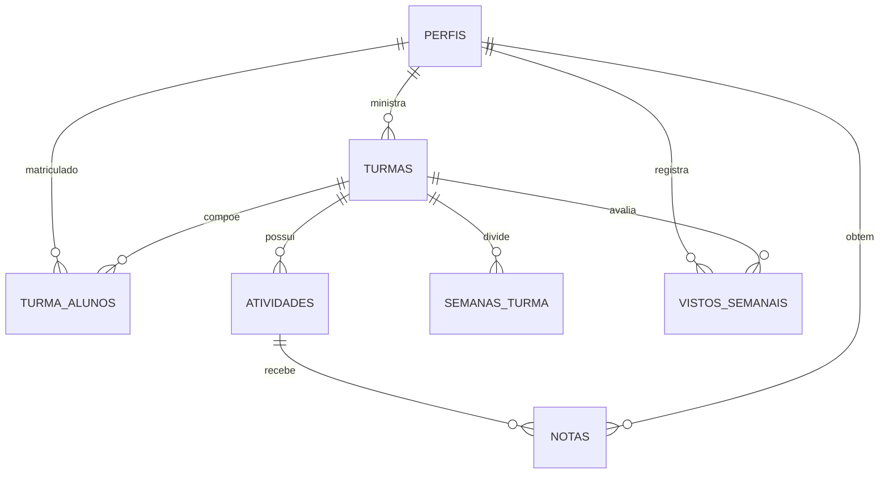

[](https://github.com/MaelBG/Media_facil/actions/workflows/ci.yml)


# Média Fácil — Sistema de Gestão e Rendimento Acadêmico

> **Média Fácil** é uma plataforma educacional desenvolvida para otimizar a rotina docente e oferecer transparência ao acompanhamento acadêmico dos estudantes. O sistema automatiza o cálculo de médias ponderadas, o registro de vistos em cadernos e a gestão contínua de turmas e avaliações.

---

## Principais Diferenciais

* **Desempenho e Sincronização em Tempo Real:** Construído com React 19 e Supabase (PostgreSQL), garantindo atualização instantânea e salvamento automático das notas.
* **Ordenação Multicritério:** Classificação dinâmica das turmas por Nome (A-Z / Z-A), Média Final Ponderada ou notas de componentes específicos (Provas, Prova Paulista, Atividades e Vistos).
* **Fórmula de Média Configurável:** Definição de pesos percentuais para Provas/Projetos, Prova Paulista, Entregas de Atividades e Vistos do Caderno com normalização automática.
* **Arquitetura de Segurança RLS:** Isolamento de dados entre turmas via Row Level Security (RLS) e funções no esquema `private` (`SECURITY DEFINER`) para evitar recursão no Postgres.
* **Arquitetura Híbrida (Cloud e Local Fallback):** Funciona integrado ao Supabase ou em modo offline utilizando `localStorage` caso as variáveis de ambiente não estejam presentes.
* **Modo Escuro (Dark Mode):** Interface adaptável com contraste calibrado para reduzir o cansaço visual em usos prolongados.
* **Proteção de Acesso:** Rate limiting contra tentativas incorretas de login (lockout temporário de 60s) e convenção de e-mails institucionais por escola (`@barao.com` e `@diogenes.com`).

---

## Funcionalidades da Plataforma

### Portal do Professor

* **Gestão de Turmas:**
  * Organização de turmas por sala e ano letivo.
  * Resumo com total de matriculados e média geral da sala.
* **Diário de Classe em Abas:**
  * **Visão Geral & Boletim:** Planilha consolidada com médias parciais, média final e situação do aluno (*Aprovado*, *Recuperação*, *Reprovado*).
  * **Provas & Projetos:** Lançamento numérico com limites validados e pesos ponderados.
  * **Prova Paulista:** Lançamento específico para avaliações padronizadas estaduais.
  * **Entrega de Atividades:** Checklist de entregas com pontuação dinâmica.
  * **Controle de Vistos Semanais:** Acompanhamento por semanas letivas do caderno dos estudantes.
* **Gestão de Alunos:**
  * Cadastro simplificado, edição de dados e remoção com atualização imediata da chamada.

### Portal do Aluno

* **Painel de Rendimento Individual:** Visualização transparente das notas por disciplina e situação acadêmica.
* **Detalhamento da Média:** Transparência sobre o impacto de cada componente (Provas, Atividades, Vistos) no resultado final.
* **Acompanhamento de Cadernos:** Registro das semanas com vistos confirmados e pendências.
* **Interface Responsiva:** Adaptada para navegação em dispositivos móveis e desktops.

---

## Stack Tecnológica

| Camada | Tecnologia | Descrição |
| :--- | :--- | :--- |
| **Interface** | React 19 | Componentização reativa de alto desempenho |
| **Ferramenta de Build** | Vite 8 | Servidor de desenvolvimento rápido e bundler otimizado |
| **Estilização** | TailwindCSS 4 | Estilização utility-first com suporte a tokens de design e Dark Mode |
| **Backend / Banco** | Supabase | PostgreSQL com GoTrue Auth e políticas de RLS |
| **Ícones** | Lucide React | Biblioteca de ícones vetoriais |
| **Testes e CI** | Playwright / GitHub Actions | Testes end-to-end e integração contínua |

---

## Estrutura do Banco de Dados


```mermaid
erDiagram
    PERFIS ||--o{ TURMAS : "ministra"
    PERFIS ||--o{ TURMA_ALUNOS : "matriculado"
    TURMAS ||--o{ TURMA_ALUNOS : "compoe"
    TURMAS ||--o{ ATIVIDADES : "possui"
    TURMAS ||--o{ SEMANAS_TURMA : "divide"
    ATIVIDADES ||--o{ NOTAS : "recebe"
    PERFIS ||--o{ NOTAS : "obtem"
    PERFIS ||--o{ VISTOS_SEMANAIS : "registra"
    TURMAS ||--o{ VISTOS_SEMANAIS : "avalia"
```

### Segurança e RLS
Para evitar recursão em políticas de acesso com tabelas N:N (`turma_alunos`), as checagens de permissão são encapsuladas em funções no esquema privado `private` com privilégios `SECURITY DEFINER`:

* `private.is_professor_of_turma(p_turma_id, p_user_id)`: Valida se o usuário logado é o docente da turma.
* `private.is_aluno_in_turma(p_turma_id, p_user_id)`: Valida o vínculo do aluno com a turma.

---

## Instalação e Execução Local

### 1. Pré-requisitos
* Node.js 18 ou superior
* npm ou yarn

### 2. Clonar e Instalar Dependências
```bash
git clone https://github.com/MaelBG/Media_facil.git
cd Media_facil
npm install
```

### 3. Variáveis de Ambiente
Crie um arquivo `.env` na raiz do projeto (baseado em `.env.example`):
```env
VITE_SUPABASE_URL=https://seu-projeto.supabase.co
VITE_SUPABASE_ANON_KEY=sua-chave-anon-publica-aqui
```

### 4. Executar em Desenvolvimento
```bash
npm run dev
```

### 5. Build de Produção
```bash
npm run build
```

---

## Diretrizes de Design
A interface utiliza a paleta **Serene Academic** focada em acessibilidade e ergonomia visual:

* **Primary:** `#3b608c`
* **Secondary:** `#366758`
* **Modo Escuro:** Cores frias de superfície (`#111318` a `#181b22`) com alto contraste em textos e componentes.

---

## Licença

Este projeto é disponibilizado sob a licença **MIT**.
