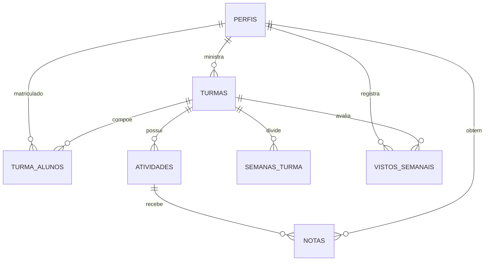

[](https://github.com/MaelBG/Media_facil/actions/workflows/ci.yml)


# 🎓 Média Fácil — Sistema de Gestão e Rendimento Acadêmico

> **Média Fácil** é uma plataforma educacional moderna, de alto desempenho e design intencional, projetada para otimizar o fluxo de trabalho docente e oferecer transparência total sobre a evolução acadêmica dos estudantes. O sistema automatiza o cálculo de médias ponderadas complexas, o registro de vistos em cadernos e a gestão contínua de turmas e avaliações.

---

## ✨ Principais Diferenciais

* **⚡ Desempenho e Sincronização em Tempo Real:** Arquitetura reativa baseada em React 19 e Supabase (PostgreSQL), garantindo atualizações instantâneas e salvamento automático sem perda de dados.
* **📊 Ordenação Multicritério Avançada:** Classificação dinâmica das turmas em tempo real por Nome (A-Z / Z-A), Média Final Ponderada, ou notas de componentes específicos (Provas, Prova Paulista, Atividades ou Vistos Semanais).
* **🎛️ Fórmula de Média Flexível e Personalizável:** Configuração intuitiva de pesos percentuais para Provas/Projetos, Prova Paulista, Entregas de Atividades e Vistos do Caderno, com normalização automática.
* **🛡️ Segurança de Nível Empresarial & RLS Antirrecursão:** Proteção granular com Row Level Security (RLS) e funções encapsuladas no esquema `private` (`SECURITY DEFINER`), eliminando recursões e garantindo isolamento total entre turmas.
* **🔌 Arquitetura Híbrida Inteligente (Cloud & Local Fallback):** Transição transparente entre a nuvem Supabase e a persistência local offline (`localStorage`), permitindo demonstrações e uso contínuo sem dependência externa.
* **🌙 Modo Escuro Premium (Dark Mode):** Interface Serene Academic com contraste calibrado (Material Design 3), reduzindo o cansaço visual do professor durante longas sessões de lançamento de notas.
* **🔐 Proteção no Acesso e Convenção Institucional de E-mails:** Proteção ativa contra força bruta (Rate Limiting com lockout de 60s) e padrão unificado de login por escola (ex: `@barao.com` para a E.E. Barão e `@diogenes.com` para a E.E. Diógenes).

---

## 🚀 Funcionalidades da Plataforma

### 👨‍🏫 Portal do Professor

* **Gestão Consolidada de Turmas:**
  * Criação, edição e organização de turmas por sala e ano letivo.
  * Estatísticas gerais da turma (total de alunos matriculados e média ponderada da sala).
* **Diário de Classe & Lançamento Flexível:**
  * **Aba Visão Geral & Boletim:** Planilha consolidada com médias parciais, média final ponderada e indicação automática da situação do aluno (*Aprovado*, *Recuperação*, *Reprovado*).
  * **Aba Provas & Projetos:** Lançamento de notas numéricas com limites validados e notas ponderadas.
  * **Aba Prova Paulista:** Lançamento e acompanhamento específico para avaliações padronizadas estaduais.
  * **Aba Entrega de Atividades:** Checklist interativo de entregas com pontuação dinâmica.
  * **Aba Controle de Vistos Semanais:** Gestão visual por semanas letivas do caderno dos estudantes.
* **Gestão de Alunos:**
  * Cadastro individual simplificado com geração de credenciais automáticas.
  * Edição de dados e remoção de alunos com atualização instantânea da chamada.

### 👩‍🎓 Portal do Aluno

* **Dashboard de Rendimento Individual:**
  * Visualização transparente das notas por disciplina e situação acadêmica.
  * Histórico comparativo das avaliações e progresso ao longo do semestre.
* **Detalhamento do Cálculo da Média:**
  * Discriminação exata do impacto de cada componente (Provas, Atividades, Vistos) no resultado final.
* **Acompanhamento de Vistos de Caderno:**
  * Registro visual das semanas com vistos confirmados e eventuais pendências.
* **Interface Totalmente Responsiva:**
  * Layout otimizado para celulares, tablets e computadores.

---

## 🛠️ Stack Tecnológica

| Camada | Tecnologia | Descrição |
| :--- | :--- | :--- |
| **Core UI** | [React 19](https://react.dev/) | Componentização reativa de alto desempenho |
| **Build Tool** | [Vite v8](https://vite.dev/) | HMR ultra-rápido e empacotamento otimizado |
| **Estilização** | [TailwindCSS v4](https://tailwindcss.com/) | Sistema de design utility-first com suporte a tokens e Dark Mode |
| **Backend & Banco** | [Supabase](https://supabase.com/) | PostgreSQL com GoTrue Auth, Realtime e RLS Policies |
| **Ícones & UI** | [Lucide React](https://lucide.dev/) | Biblioteca moderna de ícones vetoriais |
| **Testes & CI** | [Playwright](https://playwright.dev/) / GitHub Actions | Testes automatizados e integração contínua |

---

## 📐 Estrutura do Banco de Dados (PostgreSQL / Supabase)


```mermaid
erDiagram
    PERFIS ||--o{ TURMAS : "ministra"
    PERFIS ||--o{ TURMA_ALUNOS : "matriculado"
    TURMAS ||--o{ TURMA_ALUNOS : "compoe"
    TURMAS ||--o{ ATIVIDADES : "possui"
    TURMAS ||--o{ SEMANAS_TURMA : "divide"
    ATIVIDADES ||--o{ NOTAS : "recebe"
    PERFIS ||--o{ NOTAS : "obtem"
    PERFIS ||--o{ VISTOS_SEMANAIS : "registra"
    TURMAS ||--o{ VISTOS_SEMANAIS : "avalia"
```

### Regras de Segurança (RLS & Arquitetura Private)
Para contornar o problema clássico de **recursão infinita** nas políticas RLS do Supabase em tabelas de relacionamento como `turma_alunos`, o projeto utiliza o esquema privado `private` com funções de suporte em modo `SECURITY DEFINER`:

* `private.is_professor_of_turma(p_turma_id, p_user_id)`: Confirma se o usuário logado é o docente responsável pela turma.
* `private.is_aluno_in_turma(p_turma_id, p_user_id)`: Valida o vínculo do estudante com a turma sem disparar recursão RLS na tabela `perfis`.

---

## 💻 Guia de Instalação e Uso Local

### 1. Pré-requisitos
* [Node.js](https://nodejs.org/) (Versão 18 ou superior)
* `npm` ou `yarn`

### 2. Clonar o Repositório e Instalar Dependências
```bash
git clone https://github.com/MaelBG/Media_facil.git
cd Media_facil
npm install
```

### 3. Configurar Variáveis de Ambiente
Crie um arquivo `.env` na raiz do projeto contendo suas chaves do Supabase (consulte `.env.example`):
```env
VITE_SUPABASE_URL=https://seu-projeto.supabase.co
VITE_SUPABASE_ANON_KEY=sua-chave-anon-publica-aqui
```

### 4. Executar em Modo de Desenvolvimento
```bash
npm run dev
```
Acesse `http://localhost:5173/` no seu navegador.

### 5. Executar o Build de Produção
```bash
npm run build
```

---

## 🎨 Guia de Design (Serene Academic)
O design do **Média Fácil** foi projetado seguindo as diretrizes documentadas em `docs/DESIGN.md`. A paleta de cores combina serenidade visual com alta acessibilidade para o cotidiano acadêmico:

* **Primary (Serenity Blue):** `#3b608c` — Foco, confiança e clareza.
* **Secondary (Mint Emerald):** `#366758` — Conclusão positiva e progresso.
* **Modo Escuro (Dark Premium):** Paleta calibrada em tons frios de superfície (`#111318` a `#181b22`) com alto contraste de texto e badges adaptadas.

---

## 📜 Licença

Este projeto está sob a licença **MIT**.
